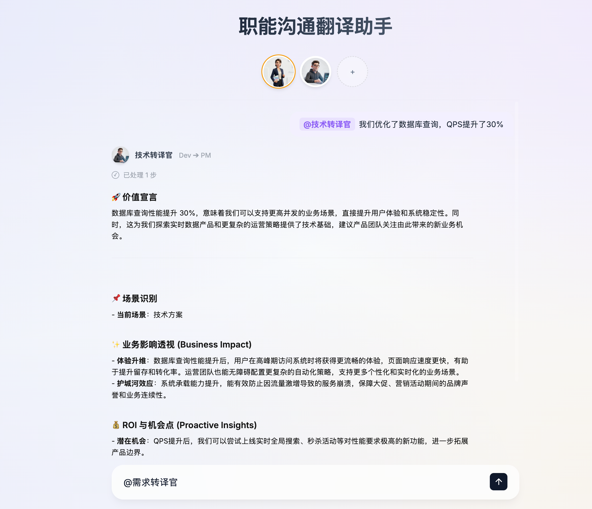
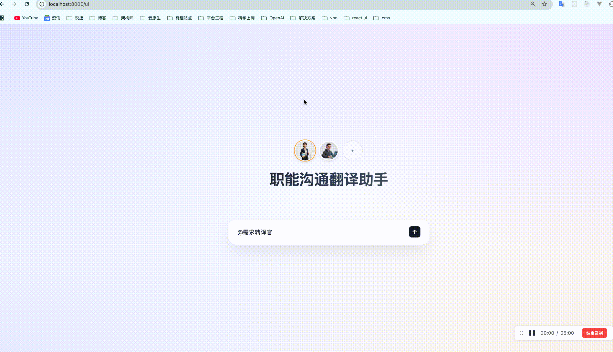

# 职能沟通翻译助手 (Functional Communication Translation Assistant)

这是一个旨在消除产品经理(PM)与开发工程师(Dev)之间沟通隔阂的 AI 工具。它能将业务语言翻译成深度技术规格，也能将复杂的技术方案转化为易懂的商业价值。

## 核心功能

- **PM -> 开发翻译**：输入模糊的业务需求，生成包含算法建议、数据流、性能指标和工作量预估的技术文档。
- **开发 -> PM 翻译**：输入技术优化或方案，生成包含用户体验提升、业务增长空间和商业价值的业务报告。
- **流式输出**：集成大模型流式生成能力，实时查看翻译过程。
- **高级 UI**：基于玻璃拟态 (Glassmorphism) 设计的现代化深色模式界面。

## 🛠️ 技术栈 (Tech Stack)

### 后端 (Backend)
- **核心框架**: [FastAPI](https://fastapi.tiangolo.com/) - 高性能异步 Web 框架
- **AI 工作流**: [LangGraph](https://langchain-ai.github.io/langgraph/) - 负责多步转译逻辑与状态管理
- **LLM 集成**: [LangChain OpenAI](https://github.com/langchain-ai/langchain)
- **数据校验**: [Pydantic v2](https://docs.pydantic.dev/)

### 前端 (Frontend)
- **设计风格**: 原生 CSS (Modern CSS) - 实现高质感的玻璃拟态 (Glassmorphism) 与动态背景
- **交互逻辑**: 原生 JavaScript - 实现 SSE 流式渲染与 Markdown 实时解析

### 其他 (Utilities)
- **环境解析**: `python-dotenv`
- **服务器**: `uvicorn`

## 📁 极简工程架构 (Project Structure)

项目采用全扁平化设计，实现了 API 与 UI 的深度集成：
- **`main.py`**：全栈入口。集成了 FastAPI 初始化、API 路由分发及 UI 静态资源托管。
- **`ui/`**：前端资产目录，包含玻璃拟态界面的 HTML/JS/CSS。
- **`api/`**：接口层。定义了 `/translate` 等核心业务路由。
- **`services/`**：逻辑层。封装了基于 **LangGraph** 的翻译工作流引擎。
- **`core/`**：配置层。管理系统提示词 (Prompts) 与环境变量。
- **`models/`**：数据层。定义 Pydantic 数据校验模型。

## 快速开始

### 1. 环境准备
确保已安装 Python 3.10+，并安装核心依赖：
```bash
pip install -r requirements.txt
```

### 2. 配置环境
在项目根目录创建 `.env` 文件：
```env
OPENAI_API_KEY=你的API密钥
OPENAI_BASE_URL=代理地址(可选)
OPENAI_MODEL=gpt-4o (推荐)
```

### 3. 一键启动
直接运行根目录的入口文件：
```bash
python main.py
```

### 4. 访问界面
服务启动后，后端将自动托管前端：
- **Web 界面**: [http://127.0.0.1:8000/ui](http://127.0.0.1:8000/ui)
- **API 文档**: [http://127.0.0.1:8000/docs](http://127.0.0.1:8000/docs)


## 🎬 功能演示 (Visual Demos)

### 界面预览 (Interface Preview)


### Demo: 产品视角 -> 开发视角 (PM ➔ Dev)
输入模糊的业务需求，AI 主动补齐架构假设与技术风险。



## 测试用例

### 用例 1: 产品视角 -> 开发视角
- **输入**: "我们需要一个智能推荐功能,提升用户停留时长"
- **预期翻译**: 应包含协同过滤/内容推荐算法建议、用户行为日志数据源说明、推荐接口延迟要求（如 <100ms）以及大致的开发周期预估。

### 用例 2: 开发视角 -> 产品视角
- **输入**: "我们优化了数据库查询，QPS提升了30%"
- **预期翻译**: 应强调在高并发场景下用户访问更流畅（不卡顿）、能够支持未来 30% 的流量增长、以及服务器硬件成本的潜在节省。

## 🧠 提示词设计思路 (Prompt Design Strategy)

本项目提示词 (Prompt) 的设计核心已从简单的“格式转换”升华为 **“认知对齐与专家咨询”**。

### 🎯 核心设计哲学
我们不仅仅是在翻译文字，而是在 **缝合认知鸿沟**。提示词的设计围绕着“PM 关注价值，Dev 关注实现”这一本质矛盾展开。

### 💎 5 大关键设计点

1. **深度人格化 (Deep Persona Injection)**
   - **设计点**：不只是“翻译器”，而是“资深架构师”与“资深产品 Lead”。
   - **效果**：赋予 AI 决策权。它敢于质疑不合理的需求，敢于基于经验做技术假设，从而输出具有权威性的“指导意见”而非简单的文字复读。

2. **开场白引导 (Heuristic Intro & Guidance)**
   - **设计点**：新增 `专家开场白` / `价值宣言` 模块。
   - **效果**：在详细列表之前给出定性评价。这类似于真人在沟通时先说“这个事儿的核心难点在...”或者“这个优化的商业意义在于...”，极大地增强了专业感，并为后续细节埋下伏笔。

3. **主动补齐逻辑 (Proactive Gap Filling)**
   - **设计点**：要求 AI 遵循“**主动填补、风险前置**”原则。
   - **效果**：针对模糊输入（如“我要个搜索功能”），AI 会利用行业标准主动假设 QPS 规模、一致性级别等关键非功能性指标。变“等待指令”为“主动咨询”。

4. **场景感知与差异化输出 (Scenario-Aware Structuring)**
   - **设计点**：明确区分 `需求讨论` 与 `技术方案` 场景。
   - **效果**：
     - **PM ➔ Dev**：重点转向架构、组件、异常分支和人天估算。
     - **Dev ➔ PM**：重点转向 UX 感受、ROI、护城河效应以及可对外汇报的“金句”。

5. **商业价值升华 (Business Value Ascension)**
   - **设计点**：严禁在 `Dev ➔ PM` 翻译中出现过多的技术参数，必须转化为“用户流失率”、“品牌声誉”、“未来上线速度”。
   - **效果**：通过“ROI 与机会点”模块，AI 能主动发现技术优化带来的 **新产品机会** (Proactive Insights)，将技术支出转化为业务资产。

### 🛠️ 提示词结构化模板
目前每一份提示词都遵循了以下严谨的工程化结构：
- **Role (角色)**：定义专家身份与对话对象。
- **Mission (使命)**：明确翻译的核心目标。
- **Opening (开场)**：专家视角的定性点评。
- **Principles (原则)**：主动补齐、风险前置、价值驱动。
- **Schema (结构)**：严格的 Markdown 标题输出约束。
- **Tone (语气)**：规定文档的专业口吻（如“不怒自威”、“优雅专注于结果”）。
